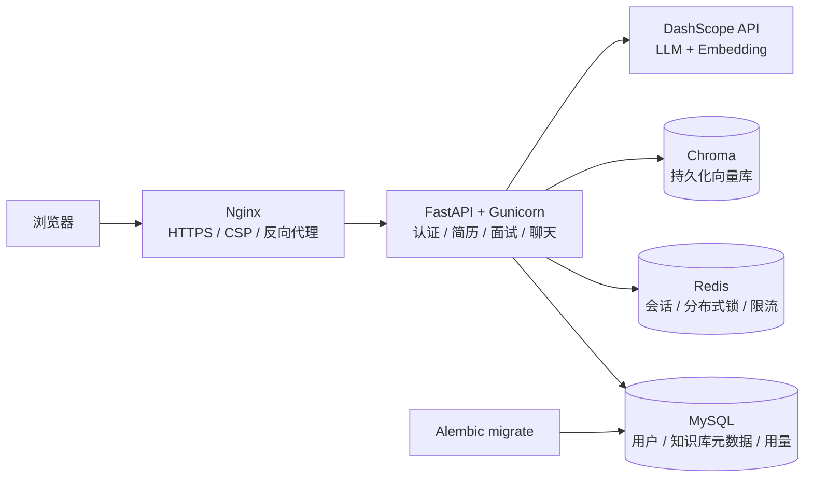

# Career Coach

Career Coach 是一个面向求职者的简历优化与 AI 模拟面试平台。项目将简历解析、目标岗位分析、流式面试对话、个人知识库检索和调用额度控制整合到一个可上线的 Web 应用中，适合作为求职作品展示和技术面试演示项目。

## 项目亮点

- **JD 定向简历优化**：支持 TXT、DOCX、PDF 简历解析，结合目标岗位和招聘 JD 生成优化建议与完整简历。
- **JD 定向模拟面试**：按目标岗位、招聘 JD 和难度创建独立面试会话，使用 POST + SSE 流式返回回答。
- **AI 求职助手**：提供独立聊天会话，支持 Redis 共享会话和并发更新锁。
- **个人知识库**：上传 TXT 面试题库，使用 DashScope `text-embedding-v4` 生成向量，并按 `user_id` 隔离检索结果。
- **用户认证**：注册、登录、退出、HttpOnly Cookie、JWT 和 401 前端跳转。
- **使用控制**：认证接口限流、LLM 接口限流、每日模型调用额度和 MySQL 用量记录。
- **生产工程化**：MySQL、Redis、Chroma、Alembic、Docker healthcheck、Gunicorn 多 Worker、Nginx HTTPS 和安全响应头。

## 系统架构



可编辑架构图源文件：[`docs/architecture.mmd`](docs/architecture.mmd)。

## 技术栈

| 层次 | 技术 |
| --- | --- |
| 前端 | HTML、CSS、原生 JavaScript、SSE 流式 fetch |
| 后端 | Python 3.12、FastAPI、Gunicorn、Uvicorn Worker |
| 关系数据库 | MySQL 8.4、SQLAlchemy 2、Alembic |
| 会话与限流 | Redis 7、TTL、分布式锁 |
| 向量检索 | Chroma 1.5.9、DashScope `text-embedding-v4` |
| 模型服务 | DashScope OpenAI 兼容 API、Qwen |
| 反向代理 | Nginx、HTTPS、CSP、安全响应头 |

## 目录结构

```text
career_coach/
├── backend/
│   ├── alembic/                 # 数据库迁移环境和版本
│   ├── assets/                  # 外部 CSS / JavaScript
│   ├── services/                # 简历、面试、聊天业务逻辑
│   ├── utils/                   # LLM、向量库等工具
│   ├── auth.py                  # 用户模型、JWT 和 MySQL 访问
│   ├── main.py                  # FastAPI 路由
│   ├── requirements.txt         # 直接依赖输入
│   └── requirements.lock        # Linux/Python 3.12 锁定依赖和哈希
├── tests/                       # 认证与核心 API 测试
├── deploy/nginx.conf            # HTTPS、反向代理和 CSP
├── deploy/nginx.http.conf       # 公网 IP 临时 HTTP 部署
├── docker-compose.ip.yml        # 2GB 服务器的 HTTP 覆盖配置
├── docker-compose.prod.yml      # 生产服务编排
├── Dockerfile                   # 生产镜像
└── .env.example                 # 非敏感配置示例
```

## 本地开发

本地开发不需要安装 Docker。需要 Python 3.12、MySQL 和 Redis；如果暂时只运行认证测试，可以直接使用项目测试命令，因为测试会使用隔离的内存 SQLite 和 Mock 外部服务。

```powershell
python -m unittest discover -s tests -v
```

启动开发服务器前，准备本地配置并完成数据库迁移：

```powershell
Copy-Item .env.example .env
cd backend
alembic upgrade head
uvicorn main:app --reload --host 127.0.0.1 --port 5200
```

访问 `http://127.0.0.1:5200/`。

## 生产部署

生产环境推荐部署到 Linux 云服务器。笔记本只负责代码管理和 SSH 操作，不需要 Docker Desktop。

1. 安装 Docker Engine 和 Compose 插件。
2. 克隆项目并复制 `.env.example` 为 `.env`。
3. 创建 `secrets/` 下的数据库、Redis、JWT 和 DashScope 密钥文件。
4. 准备 `deploy/certs/fullchain.pem` 和 `deploy/certs/privkey.pem`。
5. 将域名解析到服务器，并把 `.env` 中的 `CORS_ORIGINS` 改成真实 HTTPS 域名。
6. 启动生产服务：

```bash
docker compose -f docker-compose.prod.yml config
docker compose -f docker-compose.prod.yml up -d --build
docker compose -f docker-compose.prod.yml ps -a
docker compose -f docker-compose.prod.yml logs -f --tail=100
```

Compose 会先等待 MySQL 健康，再由 `migrate` 服务执行 `alembic upgrade head`；迁移成功且 Chroma 已启动后才启动应用。应用的 readiness 会从服务网络检查 MySQL、Redis 和 Chroma，Nginx 最后等待应用就绪。

默认镜像地址通过 DaoCloud 公益镜像代理访问 Docker Hub，适合中国内地服务器首次部署。所有镜像地址均可在 `.env` 中通过 `PYTHON_IMAGE`、`MYSQL_IMAGE`、`REDIS_IMAGE`、`CHROMA_IMAGE` 和 `NGINX_IMAGE` 覆盖，后续可切换为个人阿里云 ACR 仓库。

Docker 构建阶段默认通过阿里云 PyPI 镜像安装 Python 依赖，并将下载超时提高到 120 秒；依赖仍使用 `requirements.lock` 和 `--require-hashes` 校验。可通过 `.env` 中的 `PIP_INDEX_URL`、`PIP_TIMEOUT` 覆盖。

### 公网 IP 临时部署

没有域名和 HTTPS 证书时，可以在低流量、2GB 内存服务器上使用 HTTP 覆盖配置。该配置只开放 `80` 端口、将 Gunicorn Worker 降为 `1`，并临时关闭 Cookie 的 `Secure` 标志以支持 HTTP 登录；MySQL、Redis、Chroma 和 FastAPI 内部端口仍不会直接暴露到公网。

```bash
docker compose -f docker-compose.prod.yml -f docker-compose.ip.yml config
docker compose -f docker-compose.prod.yml -f docker-compose.ip.yml up -d --build
docker compose -f docker-compose.prod.yml -f docker-compose.ip.yml ps -a
```

随后访问 `http://服务器公网IP/`。HTTP 只适合临时部署测试；绑定域名并准备正式证书后，应改回上一节的 HTTPS 启动方式。

## 配置与密钥

`.env` 只保存非敏感配置。生产密钥必须使用 Docker Secrets 文件：

```text
secrets/database_url
secrets/mysql_password
secrets/mysql_root_password
secrets/redis_password
secrets/jwt_secret
secrets/dashscope_api_key
```

DashScope Embedding 配置示例：

```env
DASHSCOPE_BASE_URL=https://dashscope.aliyuncs.com/compatible-mode/v1
EMBEDDING_MODEL=text-embedding-v4
EMBEDDING_BATCH_SIZE=10
EMBEDDING_DIMENSIONS=1024
KNOWLEDGE_COLLECTION_NAME=interview_knowledge_base_dashscope_v1
```

不要将 `.env`、`secrets/`、API Key、数据库密码或真实简历提交到 Git。切换嵌入模型后，旧 BGE 向量不能和 DashScope 向量混用，需要重新上传知识库文档。

## 主要接口

| 方法 | 路径 | 说明 |
| --- | --- | --- |
| POST | `/api/auth/register` | 注册并返回 JWT |
| POST | `/api/auth/login` | 登录并写入 HttpOnly Cookie |
| POST | `/api/auth/logout` | 退出并清理 Cookie |
| GET | `/api/auth/me` | 获取当前用户 |
| GET | `/health/live` | 存活探针 |
| GET | `/health/ready` | MySQL、Redis、Chroma 就绪探针 |
| POST | `/api/resume/upload` | 上传并解析简历 |
| POST | `/api/resume/optimize` | 根据简历、目标岗位和可选 JD 生成优化建议 |
| POST | `/api/resume/generate` | 根据简历、目标岗位和可选 JD 生成完整简历 |
| POST | `/api/interview/start` | 根据简历、目标岗位、可选 JD 和难度创建面试会话 |
| POST | `/api/interview/stream` | POST SSE 面试流式回答 |
| POST | `/api/chat/start` | 创建 AI 助手会话 |
| POST | `/api/chat/stream` | POST SSE 助手流式回答 |
| POST | `/api/knowledge/upload` | 上传个人知识库 |
| GET | `/api/knowledge/query` | 隔离检索当前用户知识库 |
| GET | `/api/usage` | 查看每日调用额度 |

## 测试

```powershell
python -m unittest discover -s tests -v
```

当前测试覆盖注册、登录、退出、JWT Cookie、重复用户、401、简历上传、简历优化、面试会话、聊天会话和知识库用户元数据隔离，共 13 项测试。测试不会连接真实 MySQL、Redis、Chroma，也不会调用 DashScope API。

## 演示说明

演示时建议使用虚构简历和示例面试题库，不要上传身份证号、手机号、邮箱、住址等真实敏感信息。公开演示环境应设置较低的每日 LLM 调用额度，并定期清理会话、知识库和用量数据。

## 后续可优化

- 增加密码重置、邮箱验证和管理员用户管理。
- 增加自动化安全测试、CI/CD 和依赖更新流程。
- 增加 MySQL 与 Chroma 备份恢复演练。
- 增加监控告警、日志轮转和用户数据导出/删除功能。

