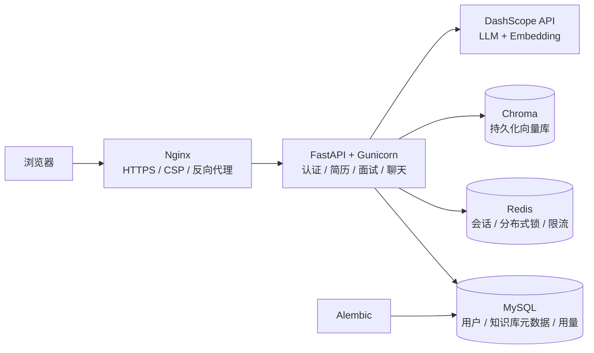

# Career Coach

> 面向求职者的 AI 求职辅导平台，提供岗位定向简历优化、岗位职责分析、AI 模拟面试、评分报告与职业咨询服务。

Career Coach 是一个覆盖“简历准备 - 岗位匹配 - 模拟面试 - 结果复盘”完整链路的 AI Agent Web 应用。项目采用前后端一体化部署，具备用户认证、数据隔离、流式交互、调用控制和生产环境配置能力，适合作为 AI 全栈项目展示与技术面试演示。

## 核心能力

- **岗位定向简历优化**：解析 TXT、DOCX、PDF 简历，结合目标岗位与岗位职责生成优化建议和完整简历，并支持按源文件类型导出。
- **岗位职责驱动的 AI 模拟面试**：结合简历、目标岗位和岗位职责进行检索增强提问，支持流式输出、换题、重新生成、跳过问题和考察点提示。
- **面试评分与报告**：根据实际问答生成综合评分、维度反馈、逐题建议与下一步提升计划，支持历史报告查看与删除。
- **个人岗位知识库**：支持粘贴或上传 TXT、DOCX、PDF 岗位职责内容，使用向量检索辅助面试提问，并按用户隔离数据。
- **职业 AI 助手**：提供独立的流式职业咨询会话，支持上下文保持与会话重置。
- **账户与调用控制**：实现注册、登录、退出、JWT、HttpOnly Cookie、接口限流、每日调用额度与使用记录。

## 系统架构



可编辑架构图源文件：[`docs/architecture.mmd`](docs/architecture.mmd)。

## 技术栈

| 模块 | 技术方案 |
| --- | --- |
| 前端 | HTML、CSS、原生 JavaScript、Fetch、POST + SSE |
| 后端 | Python 3.12、FastAPI、Gunicorn、Uvicorn Worker |
| 数据库 | MySQL 8.4、SQLAlchemy 2、Alembic |
| 会话与限流 | Redis 7、TTL、分布式锁 |
| 向量检索 | ChromaDB、DashScope `text-embedding-v4` |
| 模型服务 | DashScope OpenAI 兼容 API、Qwen |
| 部署 | Docker Compose、Nginx、HTTPS、安全响应头 |

## 工程设计

- Redis 统一保存会话，使用 UUID 会话 ID 与分布式锁防止多 Worker 并发覆盖。
- MySQL 持久化用户、调用用量、知识库元数据与面试历史；知识库检索按 `user_id` 隔离。
- JWT 与 HttpOnly Cookie 保护受限接口；注册与 LLM 接口均配置限流和调用额度控制。
- 面试、职业咨询均通过 POST + SSE 传输内容，避免敏感简历和回答出现在 URL 与访问日志中。
- 使用 Alembic 管理数据库结构演进，Docker healthcheck 协调 MySQL、Redis、Chroma、应用与 Nginx 的启动顺序。
- Nginx 配置 HTTPS、HSTS、CSP、X-Frame-Options、Referrer-Policy 等安全响应头。

## 项目结构

```text
career_coach/
├── backend/                 # FastAPI 应用、业务服务与数据库迁移
├── tests/                   # 认证、简历、面试、知识库与历史记录测试
├── deploy/                  # Nginx 反向代理配置
├── docker-compose.prod.yml  # 生产服务编排
├── Dockerfile               # 应用镜像构建
└── docs/                    # 架构图与项目文档
```

## 快速开始

### 运行测试

```powershell
python -m unittest discover -s tests -v
```

### 本地开发

准备 Python 3.12、MySQL、Redis 和 DashScope API Key 后：

```powershell
Copy-Item .env.example .env
cd backend
alembic upgrade head
uvicorn main:app --reload --host 127.0.0.1 --port 5200
```

浏览器访问 `http://127.0.0.1:5200/`。

### 生产部署

生产环境通过 Docker Compose 启动 MySQL、Redis、Chroma、FastAPI、Gunicorn 与 Nginx：

```bash
cp .env.example .env
# 配置 .env 与 secrets/ 中的生产密钥、数据库连接和 HTTPS 证书后执行
docker compose -f docker-compose.prod.yml up -d --build
docker compose -f docker-compose.prod.yml ps
```

正式环境通过域名和 HTTPS 访问，Nginx 负责 TLS 终止、反向代理和安全响应头。

## 质量保障

```powershell
python -m unittest discover -s tests -v
```

测试覆盖认证、简历解析与导出、岗位职责知识库、面试会话、评分报告、历史记录、用户隔离与核心安全控制。

## 安全说明

请勿提交 `.env`、`secrets/`、API Key、数据库密码或真实用户简历。公开演示时建议使用脱敏或虚构的简历内容。
